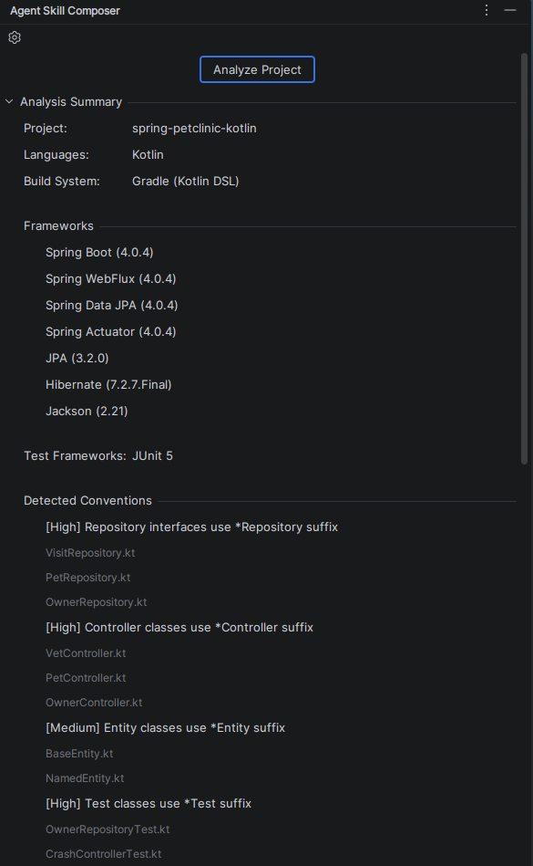
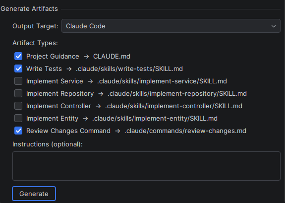
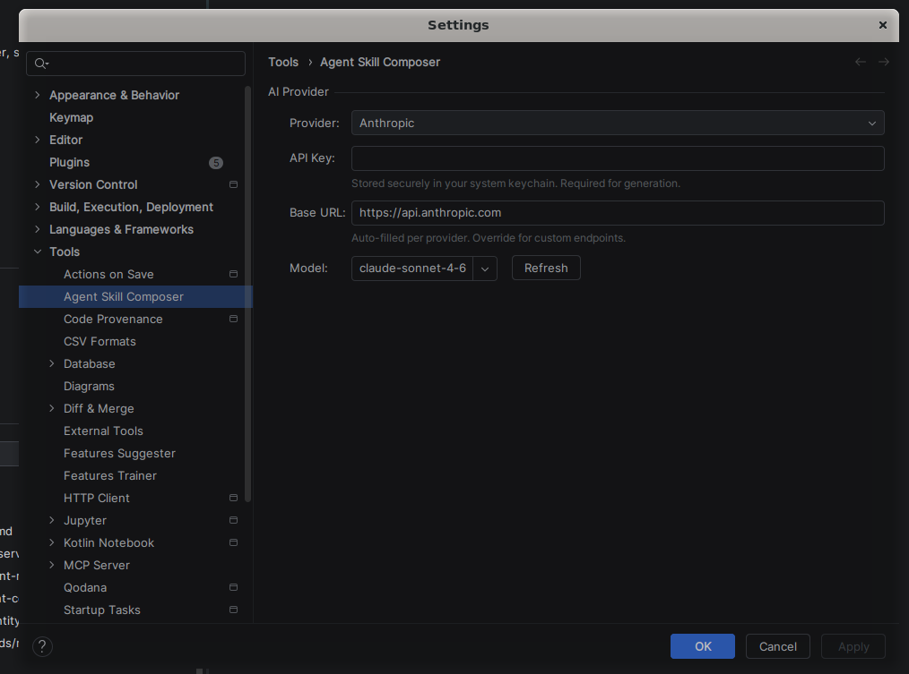

# Agent Skill Composer

An IntelliJ Platform plugin that generates project-specific agent guidance for **JetBrains Junie** and **Claude Code**. It combines deterministic repository analysis driven by the IntelliJ SDK with a configurable AI provider that synthesizes the prose.

Target languages in this release: Kotlin and Java.



## The problem

Teams adopting coding agents end up writing `AGENTS.md`, `CLAUDE.md`, and per-task skill files by hand. The files drift from reality, miss repository-specific conventions, and read like copy-pasted boilerplate. Asking an agent to write its own guidance is worse: the model produces plausible text that is not anchored to anything in the codebase.

The plugin addresses both failure modes by keeping two responsibilities strictly separate.

1. **Evidence extraction is deterministic.** Structured facts are produced by first-party IntelliJ SDK APIs. The same project always produces the same facts.
2. **Prose synthesis is AI-driven.** The model receives those facts as a tightly structured prompt and is asked to write guidance grounded in them. It never sees the repository directly and cannot invent facts about it.

This split is the central design choice. It is the reason generated artifacts read like a teammate wrote them for this specific repository, and it is the reason a reviewer can reason about correctness: every claim in a generated file is traceable to a PSI observation, a resolved dependency, or a concrete file path.

## What gets produced

Generated artifacts are written at these paths in the user's project:

| Target | Artifact | Path |
|---|---|---|
| Junie | Project guidance | `.junie/AGENTS.md` |
| Junie | Skill (per suggestion) | `.junie/skills/<id>/SKILL.md` |
| Claude Code | Project memory | `CLAUDE.md` |
| Claude Code | Skill (per suggestion) | `.claude/skills/<id>/SKILL.md` |
| Claude Code | Review-changes command | `.claude/commands/review-changes.md` |

Junie skill files are written with the `name` + `description` YAML frontmatter Junie expects. Skill suggestions are dynamic: `SkillSuggestionEngine` derives them from what the repository actually contains, so a plain-JPA backend yields a different skill set than a Spring WebFlux service.



## How evidence becomes a prompt

The analyzer orchestrator produces a `ProjectFacts` value. `DefaultPromptFactory` then serializes it into a prompt that reads, in order: request metadata, output contract, project summary, frameworks, paths, detected conventions, representative files, suggested skills, user instructions, and a final synthesis instruction. Each detected convention carries a `ConventionConfidence` and an evidence list, and `LOW` confidence items are filtered out so weak signals do not reach the model.

A simplified excerpt from a real prompt on a Kotlin Spring Boot repository:

```
### DETECTED CONVENTIONS
- NAMING (HIGH): Services end with "Service", controllers with "Controller", repositories with "Repository"
  Evidence: UserService.kt, OrderService.kt, UserController.kt, OrderRepository.kt (+ 12 more)
- DI_STYLE (HIGH): Constructor injection via @Service / @Repository (no @Autowired on fields)
  Evidence: UserService.kt, OrderService.kt, PaymentService.kt
- API_ROUTES (MEDIUM): Routes grouped under /api/v1/*; REST verbs mapped via @GetMapping / @PostMapping
  Evidence: /api/v1/users, /api/v1/orders, /api/v1/payments
- TESTING_PATTERN (HIGH): JUnit 5 with backtick-quoted method names
  Evidence: `should return 404 when user missing`, `creates order with default currency`
```

The `OUTPUT CONTRACT` section's "File intention" line is resolved through the same `TargetPathResolver` that owns the write path, so the prompt cannot describe an artifact for one path while the writer saves it to another.

## Architecture

```
agent-skill-composer/
├── build.gradle.kts
├── settings.gradle.kts
├── docs/
│   ├── architecture.md
│   └── product-spec.md
└── src/
    ├── main/
    │   ├── kotlin/com/vukan/agentskillcomposer/
    │   │   ├── ui/              Tool window, panels, editor-tab preview, save flow
    │   │   ├── analysis/        IDE-native inspection, 20 analyzers
    │   │   │   └── impl/        DefaultProjectAnalyzer (orchestrator)
    │   │   ├── generation/      AiProvider, PromptFactory, ArtifactGenerator
    │   │   │   └── impl/        HttpAiProvider + Anthropic / OpenAI / Gemini
    │   │   ├── output/          Path resolution, rendering, safe writer
    │   │   │   └── impl/        DefaultTargetPathResolver, renderer, writer
    │   │   ├── model/           ProjectFacts, DetectedConvention, ArtifactType
    │   │   └── settings/        PluginSettings, ProviderType, Configurable
    │   └── resources/
    │       ├── META-INF/plugin.xml
    │       └── messages/MyMessageBundle.properties
    └── test/
        └── kotlin/com/vukan/agentskillcomposer/
            ├── analysis/        BuildFileAnalyzer, NamingConvention
            ├── generation/      DefaultPromptFactory, PromptTemplates
            ├── model/           ArtifactType
            └── output/          TargetPathResolver, MetadataResolver
```

The seven load-bearing abstractions are interfaces, with implementations in sibling `impl/` packages: `ProjectAnalyzer`, `AiProvider`, `PromptFactory`, `ArtifactGenerator`, `TargetPathResolver`, `ArtifactRenderer`, `ArtifactWriter`. This keeps the substitution points explicit and makes the pure testable surface small.

A deeper walk-through is in [docs/architecture.md](docs/architecture.md). Product scope, non-goals, and MVP definition are in [docs/product-spec.md](docs/product-spec.md).

## What the analysis layer detects

Twenty analyzers run under `DefaultProjectAnalyzer`. The orchestrator collects the file index once, partitions it into source and test files, and passes it to the heuristic analyzers; PSI-based analyzers receive `Project` directly. Each analyzer is wrapped in `runSafe(...)` so a single failure never cascades.

| Signal | Source of truth |
|---|---|
| Build system | `VirtualFile.findChild` against known build-file names |
| Resolved dependencies | `OrderEnumerator` + `LibraryOrderEntry` |
| Languages, source and test roots | `ModuleRootManager` + `FilenameIndex` |
| Frameworks | Entry-point annotations, config files, `FacetManager` |
| Test framework and naming style | `AnnotatedElementsSearch` on `@Test` methods |
| DI style | `AnnotatedElementsSearch` across all Spring stereotypes |
| Repository supertypes, controllers, entities | PSI type resolution |
| Kotlin idioms | `KtTreeVisitorVoid`: data classes, sealed hierarchies, coroutines, extensions |
| API routes | `PsiAnnotation.findAttributeValue` on `@RequestMapping` / `@GetMapping` |
| Concurrency model | Kotlin PSI + `PsiMethod.returnType` to distinguish coroutines, reactive, blocking |
| Validation | `@Valid` and JSR-303 constraint annotations via search |
| Module structure | `ModuleManager` + `ModuleOrderEntry` |
| Naming conventions, package topology | Filename and directory heuristics (the data **is** the filename) |
| Representative files | Annotation search with filename fallback |

Every signal that could come from PSI does come from PSI. Heuristics are used only where the directory layout or filename is itself the observable.

## Provider layer

One interface, four implementations, no dependencies beyond what the platform and JDK already ship. `AiProvider` exposes `suspend fun generate(...)` and `suspend fun listModels()`. `HttpAiProvider` is an abstract base built on the JDK 21 `HttpClient` and bundled Gson.

| Provider | Generate endpoint | List-models endpoint | Auth |
|---|---|---|---|
| Anthropic | `POST /v1/messages` | `GET /v1/models` | `x-api-key` header |
| OpenAI | `POST /chat/completions` | `GET /models` | `Authorization: Bearer` |
| Google Gemini | `POST /v1beta/models/{model}:generateContent` | `GET /v1beta/models` | `x-goog-api-key` header |
| OpenAI-compatible | `POST /chat/completions` | `GET /models` | `Authorization: Bearer` |

Model lists are discovered live on provider change and on a Refresh button; the combo stays editable so a user can type an ID the server has not yet returned. API keys are held in `PasswordSafe`, never in state XML. Gemini uses a header rather than a query parameter so keys do not leak into `java.net.http` traces or proxy logs. Transient failures (HTTP 429, 5xx, fast `IOException`) retry with exponential backoff and jitter, capped at three attempts; `HttpTimeoutException` is intentionally not retried because multiplying a full timeout budget is worse than surfacing the failure.



## IntelliJ Platform specifics

Items worth calling out for reviewers familiar with the SDK.

- **Threading.** Tool-window coroutines live on a project-tied scope. EDT dispatching uses `com.intellij.openapi.application.EDT`, not `Dispatchers.Main`. The settings `Configurable` deliberately uses `ApplicationManager.executeOnPooledThread` plus `SwingUtilities.invokeLater` for model-list fetches, because `Dispatchers.EDT` does not reliably resume after `withContext(IO)` inside a `Configurable`'s lifecycle.
- **Read actions.** PSI queries run through `ReadAction.nonBlocking(...).inSmartMode(project).executeSynchronously()` so they wait for indexing rather than racing it.
- **Write actions.** File saves go through `WriteAction.computeAndWait` with `VfsUtil.createDirectoryIfMissing` and `VirtualFile.createChildData` / `setBinaryContent`. The writer also normalizes the resolved absolute path and asserts it still starts with the project root before writing, so a future regression in `TargetPathResolver` cannot traverse out of the project tree.
- **UI.** Kotlin UI DSL v2 for the settings panel. Preview opens each artifact as a read-only `LightVirtualFile` in an editor tab, which gives the user real syntax highlighting, search, and navigation without a bespoke preview component. Save uses a single Save All button with one combined overwrite prompt; the writer itself never dialogs.
- **Lifecycle.** The tool-window panel implements `Disposable`, owns a `CoroutineScope(SupervisorJob())`, and is registered as the content disposer so in-flight generation cannot fire callbacks into a disposed Swing tree.
- **Progress and cancellation.** Analysis runs under `Task.Backgroundable` with a real `ProgressIndicator`. Generation re-throws `CancellationException` so scope cancellation can interrupt the loop between sequential artifacts. An in-flight HTTP request runs to completion or to its 120 s timeout, because `HttpClient.send(...)` is synchronous on `Dispatchers.IO`. This is documented rather than hidden.

## Requirements

- IntelliJ IDEA 2026.1 (`sinceBuild = 261`, `untilBuild = 261.*`)
- JDK 21

## Build and run

```
./gradlew compileKotlin
./gradlew test
./gradlew runIde
./gradlew buildPlugin
```

`buildPlugin` writes the installable zip to `build/distributions/`. Install via *Settings* > *Plugins* > *Install Plugin from Disk...*. The plugin is not currently published to the JetBrains Marketplace.

## Usage


1. Open the **Agent Skill Composer** tool window.
2. Configure a provider under *Settings* > *Tools* > *Agent Skill Composer* or via the gear icon in the tool window. Paste an API key and pick a model from the live-fetched list.
3. Click **Analyze**. The plugin walks source and test roots, runs the analyzer orchestrator, and shows the detected facts in the summary panel.
4. Pick a target, tick the artifacts to generate, optionally add free-form instructions, and click **Generate**.
5. Review each artifact in its read-only editor tab, then click **Save All**. Existing files trigger one combined overwrite prompt; a single info balloon reports created and overwritten counts with a Reveal in Project action.

## Documentation

- [docs/architecture.md](docs/architecture.md) covers layer responsibilities, the domain model, and the design rules enforced throughout the codebase.
- [docs/product-spec.md](docs/product-spec.md) covers product goals, non-goals, and the MVP definition.

## License

See [LICENSE](LICENSE).
